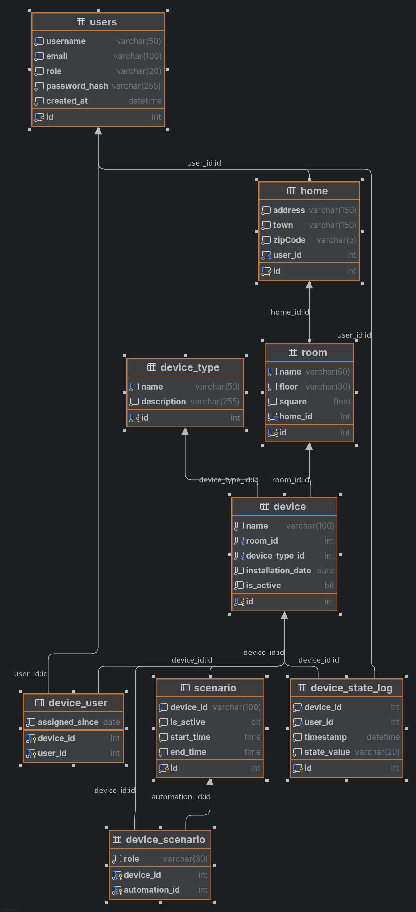

# Smart Home Management System
## Project Overview

This is a complete JavaFX desktop application for managing smart home devices, automations, and user permissions using Microsoft SQL Server as the backend database.

## Prerequisites

1. **Java Development Kit (JDK) 17 or higher**
    - Download from: https://www.oracle.com/java/technologies/javase/jdk17-archive-downloads.html
    - Ensure JAVA_HOME is set in your environment variables

2. **Maven 3.8.0 or higher**
    - Download from: https://maven.apache.org/download.cgi
    - Ensure Maven is added to your PATH

3. **Microsoft SQL Server 2019 or higher**
    - Download from: https://www.microsoft.com/en-us/sql-server/sql-server-downloads
    - SQL Server Express is sufficient for this application
    - Ensure the SQL Server service is running

## Database Schema Relationships


## Project Structure

```
├── docker-compose.yml
├── img
│   └── device.png
├── pom.xml
├── README.md
├── src
│   └── main
│       ├── java
│       │   ├── Launcher.java
│       │   └── whz
│       │       └── pti
│       │           ├── controllers
│       │           │   └── LoginController.java
│       │           ├── Main.java
│       │           ├── models
│       │           │   ├── Device.java
│       │           │   ├── DeviceScenario.java
│       │           │   ├── DeviceStateLog.java
│       │           │   ├── DeviceType.java
│       │           │   ├── DeviceUser.java
│       │           │   ├── Home.java
│       │           │   ├── Role.java
│       │           │   ├── Room.java
│       │           │   ├── Scenario.java
│       │           │   └── User.java
│       │           ├── repositories
│       │           │   ├── DeviceRepo.java
│       │           │   ├── DeviceScenarioRepo.java
│       │           │   ├── DeviceStateLogRepo.java
│       │           │   ├── DeviceTypeRepo.java
│       │           │   ├── DeviceUserRepo.java
│       │           │   ├── GeneralRepo.java
│       │           │   ├── HouseRepo.java
│       │           │   ├── implementation
│       │           │   │   ├── DeviceRepoImpl.java
│       │           │   │   ├── DeviceScenarioRepoImpl.java
│       │           │   │   ├── DeviceStateLogRepoImpl.java
│       │           │   │   ├── DeviceTypeRepoImpl.java
│       │           │   │   ├── DeviceUserRepoImpl.java
│       │           │   │   ├── GeneralRepoImpl.java
│       │           │   │   ├── HouseRepoImpl.java
│       │           │   │   ├── RoomRepoImpl.java
│       │           │   │   ├── ScenarioRepoImpl.java
│       │           │   │   └── UserRepoImpl.java
│       │           │   ├── RoomRepo.java
│       │           │   ├── ScenarioRepo.java
│       │           │   └── UserRepo.java
│       │           ├── services
│       │           │   ├── AuthService.java
│       │           │   ├── DeviceScenarioService.java
│       │           │   ├── DeviceService.java
│       │           │   ├── DeviceStateLogService.java
│       │           │   ├── DeviceTypeService.java
│       │           │   ├── DeviceUserService.java
│       │           │   ├── HouseService.java
│       │           │   ├── implementation
│       │           │   │   ├── AuthServiceImpl.java
│       │           │   │   ├── DeviceScenarioServiceImpl.java
│       │           │   │   ├── DeviceServiceImpl.java
│       │           │   │   ├── DeviceStateLogServiceImpl.java
│       │           │   │   ├── DeviceTypeServiceImpl.java
│       │           │   │   ├── DeviceUserServiceImpl.java
│       │           │   │   ├── HouseServiceImpl.java
│       │           │   │   ├── RoomServiceImpl.java
│       │           │   │   └── ScenarioServiceImpl.java
│       │           │   ├── RoomService.java
│       │           │   └── ScenarioService.java
│       │           └── utils
│       │               ├── AlertHelper.java
│       │               ├── annotations
│       │               │   ├── Column.java
│       │               │   ├── ForeignKey.java
│       │               │   └── ManyToMany.java
│       │               ├── DBConnection.java
│       │               └── PasswordService.java
│       └── resources
│           ├── config.properties
│           ├── sql
│           │   ├── create_db.sql
│           │   ├── create_table.sql
│           │   └── insert.sql
│           ├── styles
│           │   └── LoginPage.css
│           └── view
│               └── LoginPage.fxml
└── target
    ├── classes
    │   ├── config.properties
    │   ├── Launcher.class
    │   ├── sql
    │   │   ├── create_db.sql
    │   │   ├── create_table.sql
    │   │   └── insert.sql
    │   ├── styles
    │   │   └── LoginPage.css
    │   ├── view
    │   │   └── LoginPage.fxml
    │   └── whz
    │       └── pti
    │           ├── controllers
    │           │   └── LoginController.class
    │           ├── Main.class
    │           ├── models
    │           │   ├── Device.class
    │           │   ├── DeviceScenario.class
    │           │   ├── DeviceStateLog.class
    │           │   ├── DeviceType.class
    │           │   ├── DeviceUser.class
    │           │   ├── Home.class
    │           │   ├── Role.class
    │           │   ├── Room.class
    │           │   ├── Scenario.class
    │           │   └── User.class
    │           ├── repositories
    │           │   ├── DeviceRepo.class
    │           │   ├── DeviceScenarioRepo.class
    │           │   ├── DeviceStateLogRepo.class
    │           │   ├── DeviceTypeRepo.class
    │           │   ├── DeviceUserRepo.class
    │           │   ├── GeneralRepo.class
    │           │   ├── HouseRepo.class
    │           │   ├── implementation
    │           │   │   ├── DeviceRepoImpl.class
    │           │   │   ├── DeviceScenarioRepoImpl.class
    │           │   │   ├── DeviceStateLogRepoImpl.class
    │           │   │   ├── DeviceTypeRepoImpl.class
    │           │   │   ├── DeviceUserRepoImpl.class
    │           │   │   ├── GeneralRepoImpl.class
    │           │   │   ├── HouseRepoImpl.class
    │           │   │   ├── RoomRepoImpl.class
    │           │   │   ├── ScenarioRepoImpl.class
    │           │   │   └── UserRepoImpl.class
    │           │   ├── RoomRepo.class
    │           │   ├── ScenarioRepo.class
    │           │   └── UserRepo.class
    │           ├── services
    │           │   ├── AuthService.class
    │           │   ├── DeviceScenarioService.class
    │           │   ├── DeviceService.class
    │           │   ├── DeviceStateLogService.class
    │           │   ├── DeviceTypeService.class
    │           │   ├── DeviceUserService.class
    │           │   ├── HouseService.class
    │           │   ├── implementation
    │           │   │   ├── AuthServiceImpl.class
    │           │   │   ├── DeviceScenarioServiceImpl.class
    │           │   │   ├── DeviceServiceImpl.class
    │           │   │   ├── DeviceStateLogServiceImpl.class
    │           │   │   ├── DeviceTypeServiceImpl.class
    │           │   │   ├── DeviceUserServiceImpl.class
    │           │   │   ├── HouseServiceImpl.class
    │           │   │   ├── RoomServiceImpl.class
    │           │   │   └── ScenarioServiceImpl.class
    │           │   ├── RoomService.class
    │           │   └── ScenarioService.class
    │           └── utils
    │               ├── AlertHelper.class
    │               ├── annotations
    │               │   ├── Column.class
    │               │   ├── ForeignKey.class
    │               │   └── ManyToMany.class
    │               ├── DBConnection.class
    │               └── PasswordService.class
    └── generated-sources
        └── annotations

```


## Quick Start Summary

1. Install Java 17+ and Maven
2. Set up SQL Server and run the SQL scripts
3. Configure config.properties
4. Run `mvn clean install`
5. Run `mvn javafx:run`


Enjoy your Smart Home Management System!

